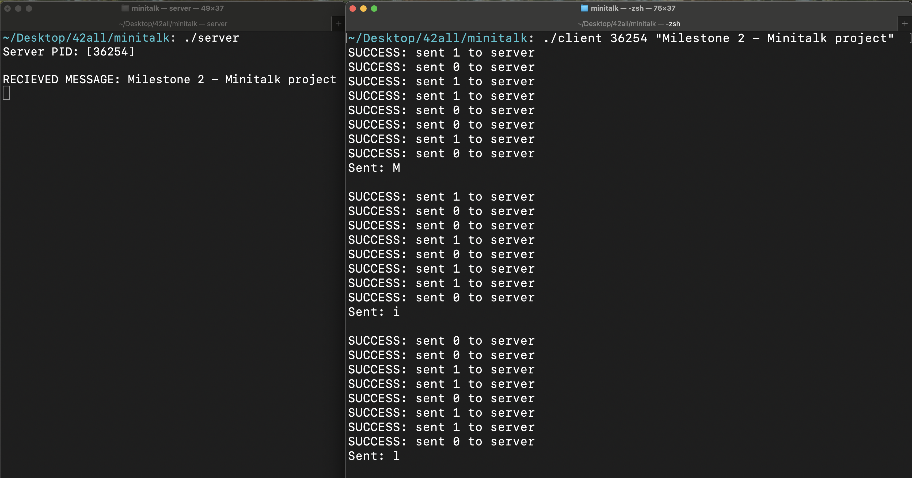
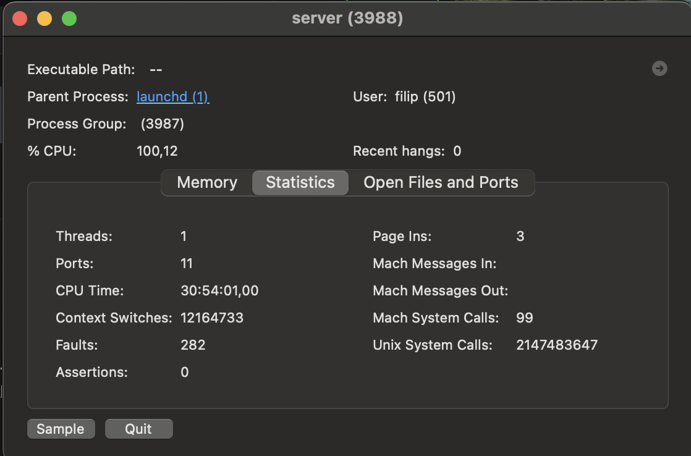
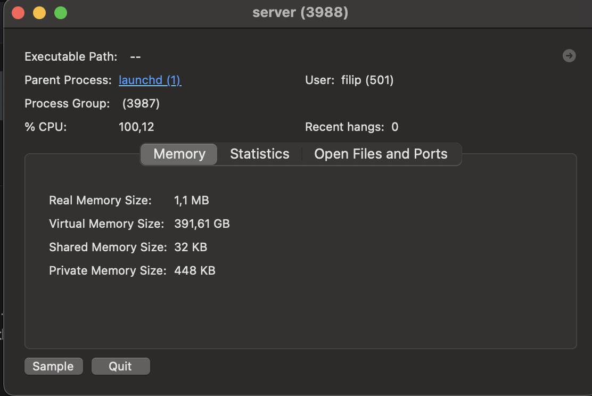

# Minitalk
## Overview

`Minitalk` is a simple `client-server` communication system implemented in `C` using `UNIX signals`. It allows a `client` to send a message to the `server` character-by-character via signal transmissions (`SIGUSR1` and `SIGUSR2`). The `server` reconstructs and prints the received message.

## How It Works
### Server
Run the `server` to start listening for messages.
Outputs its `PID`, which is required by the `client` to connect.

### Client
Sends a null-terminated string to the `server`, one bit at a time.
Receives acknowledgment signals to confirm successful transmission.

### Message Reconstruction
The `server` reconstructs the message from the received signals and prints it.
Handles null-terminated strings, marking the end of the message.

## Features
+ Signal-based Communication: Uses `SIGUSR1` and `SIGUSR2` for binary message transmission
+ Dynamic Memory Management: Efficiently builds messages character by character
+ Acknowledge System: `server` sends acknowledgments to confirm successful receipt of bits
+ Error Handling: Ensures robust behavior for invalid inputs, memory allocation failures, and unexpected signals


## Key Notes
+ Ensure proper delays (usleep) in the `client` to avoid signal congestion
+ Validate `server` `PID` and input format before sending a message

## Usage
Git clone the repository with
```
git clone git@github.com:sknefi/minitalk.git
```

Build application (`server` and `client`)
```
make
```

In one terminal start `server` 
```
./server
```
You should see `PID` (Process ID) of `server` application, copy it

Open new terminal and send data from `client` to `server` with `[PID]` of `server`
```
./client [PID] [Message]
```

## Example
### Start server
```
./server
Server PID: [36254]
```

### Send data from client to server
```
./client 36254 "Milestone 2 - Minitalk project"
```

<br>

## Don't forget to stop server
Otherwise...
<br>
When sending huge amount of data, `usleep()` can fail sometimes, and infinite loop could occur
<br>
Just make sure you `CRTL+C` or `SIGKILL` signal
```
kill -9 [PID]
```
